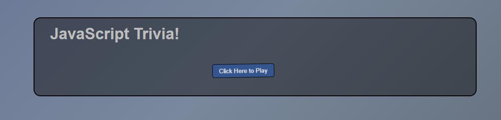
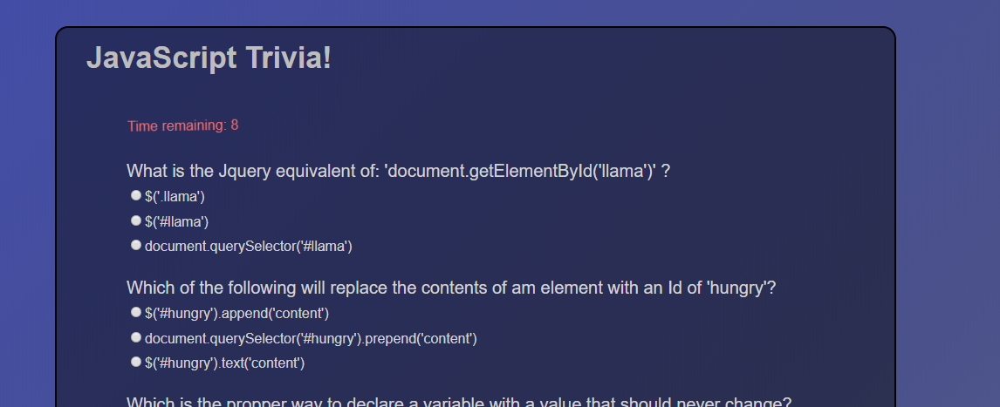

# TriviaGame

Test your knowlege of basic JavaScript and Jquery in this short trivia quiz!

Click this link to play: https://mendezandrewm.github.io/TriviaGame/

1. Click the start button to start the game

    -You will have 60 seconds to complete the quiz

1. Click the radio buttons to choose an answer for each questions

    -When you have answered to questions the best of your ability, press the submit button at the bottom

1. When complete, your total score will be displayed.

    *fully functioning try-again button coming soon..

